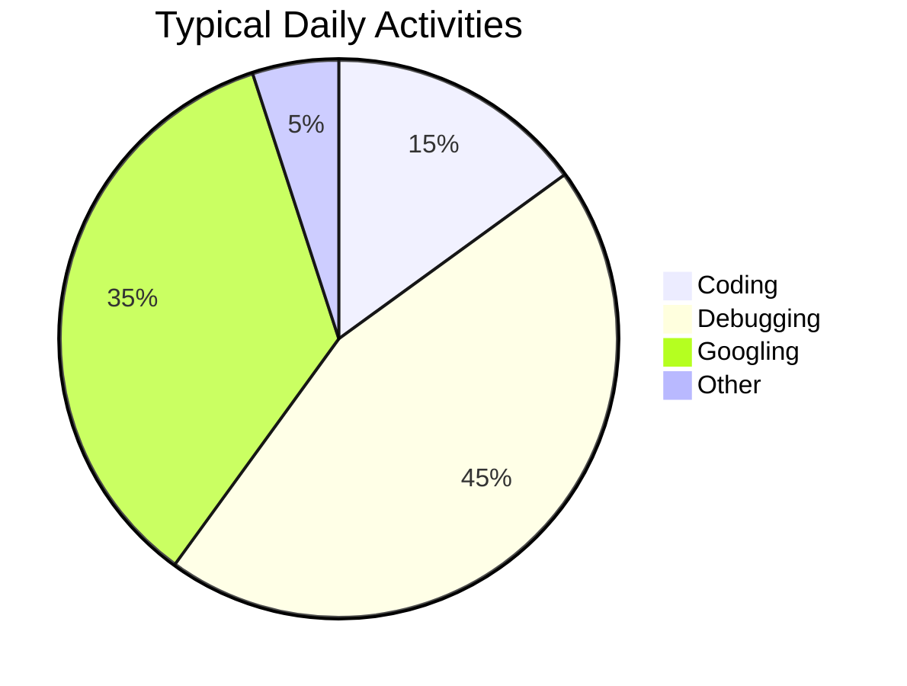
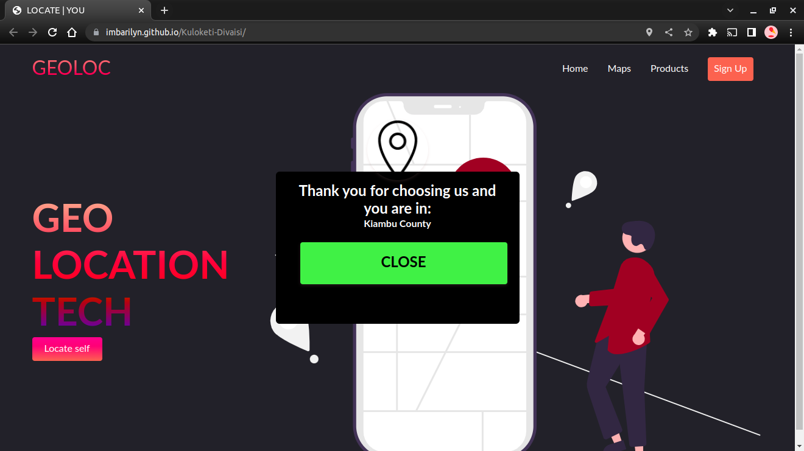
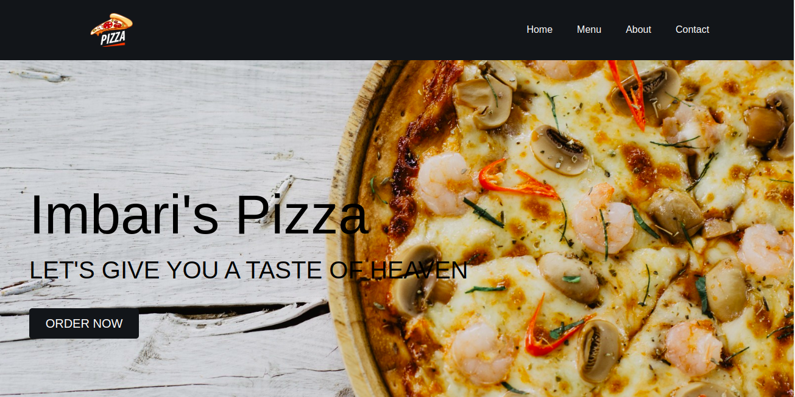

## Hi , 



[](https://git.io/typing-svg)

Linah is a code enthusiast  and innate whose aim is writing dry and clean codes. I am very much open to learning new technologies in the market so as to develop a global mindset. I am seeking a position in a
growth-oriented company where I can use my skills to the advantage of the company while having the scope to develop my skills. 

### Top Technologies

[](#) [](#) 

### 📊 Monthly development breakdown

<!--START_SECTION:waka-->

```text
From: 15 September 2022 - To: 15 October 2022

JavaScript   92 hrs 16 mins  ███████████████████░░░░░░   76.39 %
JSON         11 hrs 29 mins  ██▒░░░░░░░░░░░░░░░░░░░░░░   09.51 %
CSS          8 hrs 17 mins   █▓░░░░░░░░░░░░░░░░░░░░░░░   06.87 %
Ruby         4 hrs 27 mins   █░░░░░░░░░░░░░░░░░░░░░░░░   03.69 %
Markdown     3 hrs 29 mins   ▓░░░░░░░░░░░░░░░░░░░░░░░░   02.88 %
Other        38 mins         ░░░░░░░░░░░░░░░░░░░░░░░░░   00.53 %
```

<!--END_SECTION:waka-->

### Experience

<p align="left">
  
  
  <!--  -->
  
  
  <!--  -->
  
  
<!--  -->
  <!--  -->
  <!--  -->
  <!--  -->
  <!--  -->
  
</p>

<h2 id="sample-projects">Projects</h2>
<table>
  <tbody>
    <tr>
      <td>
        <a href="https://expense-calculator-device.vercel.app/">
          
        </a>
      </td>
      <td>
        <a href="https://expense-calculator-device.vercel.app/"
          >Expense Calculator</a>
      </td>
      <td>
        <a href="https://imbarilyn.github.io/Kuloketi-Divaisi/">
          
        </a>
      </td>
      <td>
        <a href="https://imbarilyn.github.io/Kuloketi-Divaisi/"
          >Geological Locator</a>
      </td>
        <td>
        <a href="https://imbari-pizza.vercel.app/">
          
        </a>
      </td>
      <td>
        <a href="https://imbari-pizza.vercel.app/"
          >Imbari pizza</a>
      </td>
    </tr>   
  </tbody>
</table>

<br />

  <h2>Certifications</h2>  
<table>
  <tbody>
    <tr>
      <td>
        <a href="">
          
        </a>
      </td>
      <!-- <td>
        <a href=""
          >Verify</a
        >
      </td> -->
      <!-- <td>
        <a href="https://www.hackerrank.com/certificates/12d1fbc424ce">
          
        </a>
      </td>
      <td>
        <a href="https://www.hackerrank.com/certificates/12d1fbc424ce"
          >Verify</a
        >
      </td> -->
    </tr>
  </tbody>
</table>
</details>
</h2>

<h3 align="center" style="color:yellow;margin-bottom: 20px;" >Let's Connect </h3>  
<p align='center'>
  <!-- <a href="https://www.linkedin.com/in/imbarilyn/">
    
  </a>&nbsp;&nbsp; -->
  <!-- <a href="https://instagram.com/imbarilyn.hb">
             -->
  </a>&nbsp;&nbsp;
 <!-- <a href="https://wa.me/+254792496898">
  
 </a>&nbsp;&nbsp; -->
 <a href="mailto:linahmuhonjaimbari@gmail.com">
  
 </a>&nbsp;&nbsp;
</p>

<p align='center'>
  <!-- <a href="https://twitter.com/imbarilyn_hb">
    
  </a>&nbsp;&nbsp; -->
  <!-- <a href="https://github.com/imbarilyn">
            
  </a>&nbsp;&nbsp; -->
 <!-- <a href="https://www.reddit.com/user/imbarilyn">
  
 </a>&nbsp;&nbsp; -->
 <!-- <a href="https://www.youtube.com/channel/UCgHKQfyNh8thOZtS4kfQG-A">
  
 </a>&nbsp;&nbsp; -->
</p>

## Contribution Graph

<p>
  
</p>
&nbsp;
<br />

### 🏆 <!--My Trophies-->

[](https://github.com/imbarilyn/imbarilyn)


<!--### Github Stats-->


<p></p>      

<!--### Github extra pins-->

[](https://github.com/imbarilyn/imbarilyn&show_owner=true&count_private=true)

[](https://github.com/imbarilyn/imbarilyn)
<!-- 
 -->

<!--  -->

[](https://github.com/imbarilyn/imbarilyn)

[](https://wakatime.com/@cb788a51-df66-4ab7-a791-748d096f5c6b)

### Unique Views

[](https://github.com/imbarilyn/linah-views-counter)


<p>
  <a href="https://github.com/imbarilyn?tab=followers">
    
  </a>
</p>

### 😂 Here is a random joke for you today: -


### Star my projects [here](https://github.com/imbarilyn?tab=repositories)

:relaxed:__Follow for Follow back__:relaxed:

